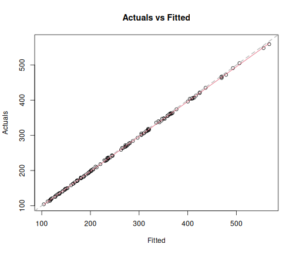
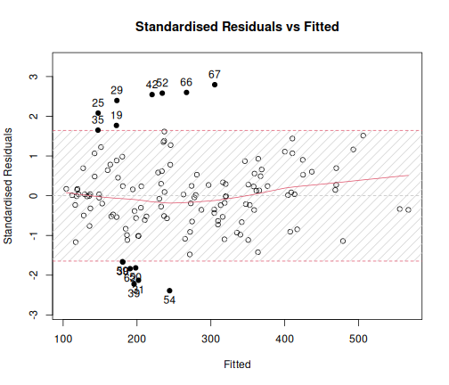
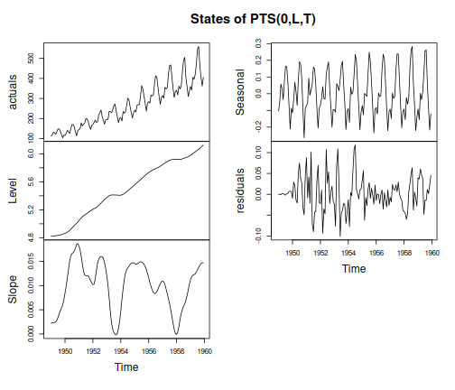
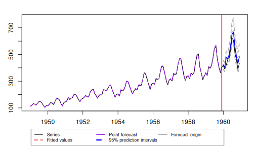
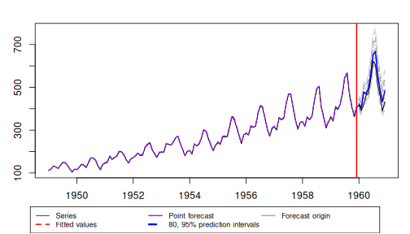

# Introduction

The `muse` package fits **PTS** (*Power / Trend / Seasonal*) state-space
models — single-source-of-error structural time-series models whose
components mirror the ETS/ADAM taxonomy.  All estimation happens through
a single user-facing function, `pts()`, which delegates to a C++ engine
(Rcpp + RcppArmadillo) running a Kalman filter / smoother under a
concentrated likelihood.

`pts()` returns an object of class `c("pts", "smooth")`, so all generics
shared with the `smooth` / `greybox` ecosystem (`forecast()`, `plot()`,
`accuracy()`, `AIC()`, `BIC()`, `simulate()`, …) work out of the box.

This vignette walks through the main features on two datasets:

* `AirPassengers` — the classic monthly airline-passenger series, useful
  for showing the Box-Cox power transformation and automatic model
  selection.
* `Seatbelts` — UK road-casualty data including a structural break
  (the 1983 seat-belt law), useful for showing external regressors and
  engine-side outlier detection.


``` r
library(muse)
```

# Quick start: AirPassengers

The simplest call lets `pts()` choose everything automatically:


``` r
air <- pts(AirPassengers, model = "ZZZ", h = 12, holdout = TRUE)
air
#> Time elapsed: 0.12 seconds
#> Model estimated using pts() function: PTS(0,L,T)
#> With Box-Cox lambda = 0
#> Periods: 12.0 / 6.0 / 4.0 / 3.0 / 2.4 / 2.0
#> Distribution assumed in the model: Normal
#> Loss function type: likelihood; Loss function value: 481.1858
#> Variance parameters:
#>                Variance Proportion
#> Level         1.352e-05    0.18060
#> Slope         6.270e-06    0.08376
#> Seas(All)     1.352e-05    0.18060
#> Irregular (*) 4.156e-05    0.55510
#> (*) concentrated out
#> 
#> Sample size: 132
#> Number of estimated parameters: 5
#> Number of degrees of freedom: 127
#> Information criteria:
#>      AIC     AICc      BIC     BICc 
#> 972.3716 972.8478 986.7856 987.9482
```

The model string is a compact three-character spec encoding **P**ower /
**T**rend / **S**easonal in that order; the three `Z`s ask the engine
to choose:

* the Box-Cox power λ (jointly with the state-space parameters),
* the trend type,
* the seasonal type.

Because we asked for `holdout = TRUE` with `h = 12`, the last 12 months
were withheld from estimation and stashed on the object for later
accuracy evaluation.

A look at the in-sample fit and residuals:


``` r
plot(air, which = c(1, 2))
```



To pull the structural decomposition (level / slope / seasonal /
irregular):


``` r
plot(air, which = 12)
```



A forecast over the holdout window:


``` r
fc <- forecast(air, h = 12)
plot(fc)
```



…and accuracy against the held-out values:


``` r
accuracy(air)
#>            ME           MAE           MSE           MPE          MAPE 
#>  -32.59029722   32.59029722 1408.85088707   -0.06861697    0.06861697 
#>           sCE          sMAE          sMSE          MASE         RMSSE 
#>   -1.48988516    0.12415710    0.02044709    1.35319459    1.19796082 
#>          SAME          rMAE         rRMSE          rAME     asymmetry 
#>    1.35319459    0.42881970    0.36449724    0.45794329   -1.00000000 
#>          sPIS 
#>    8.06862695
```

# The PTS model string

The `model` argument is a compact three-character string of the form
`"PTS"` (Power-Trend-Seasonal): position 1 is the Box-Cox λ, position 2
the trend letter, position 3 the seasonal letter.  Numeric λ values can
take more than one character (`"0.5LT"`, `"-0.3LD"`) — the trend and
seasonal letters are always read from the **last two** positions.  The
fitted object's `$model` field prints in a more readable form
(e.g. `"PTS(-0.3, G, D)"`) but that pretty-printed string is *not*
accepted as input.

## Power (`P`)

Position 1 is the Box-Cox parameter λ.  Two ways to specify it:

| Value         | Effect                                                      |
|---------------|-------------------------------------------------------------|
| `"Z"`         | Estimate λ jointly with the state-space parameters          |
| Numeric, e.g. `"0"`, `"0.5"`, `"1"` | Fix λ to that value                   |

The two singular points have exact-equality shortcuts:
`λ = 0` corresponds to a log transform, `λ = 1` corresponds to no
transform (identity).  For every other value the standard
$(y^{\lambda} - 1) / \lambda$ formula is used.  In-sample residuals,
innovations and the additive decomposition all live on the Box-Cox
scale; fitted values and forecasts are back-transformed to the
original scale.


``` r
air_log <- pts(AirPassengers, model = "0LT", h = 12, holdout = TRUE)
air_log$lambda
#> [1] 0
```

## Trend (`T`)

Position 2 picks the trend component:

| Letter | Trend type                                            |
|--------|-------------------------------------------------------|
| `Z`    | Automatic selection                                   |
| `N`    | None (random walk; level only)                        |
| `L`    | Local linear trend (level + slope)                    |
| `D`    | Damped trend (level + damped slope)                   |
| `G`    | Global / deterministic trend                          |

## Seasonal (`S`)

Position 3 picks the seasonal component:

| Letter | Seasonal type                                                 |
|--------|---------------------------------------------------------------|
| `Z`    | Automatic selection                                           |
| `N`    | No seasonal component                                         |
| `D`    | Discrete (harmonic selection from the seasonal period)        |
| `T`    | Trigonometric (equal variance across all harmonics)           |

The seasonal period is taken from `frequency(data)` by default; pass
`lags` to override.

# Automatic selection

Setting any letter to `Z` triggers an internal search over the
admissible candidates.  The information criterion is set via `ic`
(default `"AICc"`):


``` r
pts(AirPassengers, model = "ZZZ", h = 12, ic = "BIC")
```

# ARMA on the irregular component

The irregular component can itself be an ARMA / SARMA process,
controlled by `orders`:


``` r
# ARMA(2, 1) on the irregular
pts(AirPassengers, model = "ZZZ", orders = c(2, 1), h = 12)

# Seasonal SARMA(1, 1)(1, 1)_12 — non-seasonal + seasonal blocks
pts(AirPassengers, model = "ZZZ",
    orders = list(ar = c(1, 1), ma = c(1, 1), lags = c(1, 12)), h = 12)

# Automatic ARMA search up to the supplied caps
pts(AirPassengers, model = "ZZZ",
    orders = list(ar = 2, ma = 2, select = TRUE), h = 12)
```

When `orders$select = TRUE` muse runs a nested PTS-outer / ARMA-inner
selection: for every structural candidate it scores the best ARMA
order found on the residuals, and picks the joint (structure, ARMA)
pair with the lowest IC.

# Forecasting

`forecast()` is the workhorse for producing point forecasts and
prediction intervals.  The mean is always returned on the original
scale (back-transformed from Box-Cox); intervals are built by
endpoint-transforming the BC-scale bounds.


``` r
fc <- forecast(air, h = 12, interval = "prediction", level = c(0.80, 0.95))
plot(fc)
```



Three interval types are supported:

| `interval`     | Source                                                    |
|----------------|-----------------------------------------------------------|
| `"prediction"` | Default; total uncertainty from the filter                |
| `"confidence"` | Mean-only uncertainty (subtracts observation variance)    |
| `"simulated"`  | Empirical quantiles from `simulate()` paths               |
| `"none"`       | Point forecast only                                       |

`cumulative = TRUE` collapses the forecast horizon into a single
total — exact for `"simulated"`, an approximation otherwise.

# Outlier detection

`pts()` can detect and absorb outliers in a single call, mirroring the
adam-style `outliers` / `level` API:


``` r
y <- AirPassengers
y[100] <- 3 * y[100]            # inject an obvious additive spike

m_out <- pts(y, model = "ZZZ", outliers = "use", level = 0.99)
m_out$outliersDetected
#>   time type
#> 1  100   AO
```

The detected events are classified as:

* `AO` — additive outlier (one-off spike),
* `LS` — level shift (step change),
* `SC` — slope change.

`level` controls the underlying z-score threshold via
`qnorm((1 + level) / 2)` — at `0.99` ≈ 2.576.  Detected outliers are
injected as fixed dummy regressors (`AO<t>`, `LS<t>`, `SC<t>`); their
coefficients show up in `coef(m_out)` and `print()` reports a one-line
summary of how many of each type were absorbed.

Setting `outliers = "ignore"` (the default) skips the detection step
entirely.

# External regressors

`pts()` accepts a `data.frame` / `matrix` / `mts` whose first column
is the response and whose remaining columns are external regressors.
On the `Seatbelts` dataset we can use `kms`, `PetrolPrice`, and `law`
(the 1983 seat-belt law indicator) as regressors for monthly
`drivers` (drivers killed or seriously injured):


``` r
sb <- Seatbelts[, c("drivers", "kms", "PetrolPrice", "law")]
m_sb <- pts(sb, model = "ZZZ", h = 12, holdout = TRUE)
m_sb
#> Time elapsed: 0.24 seconds
#> Model estimated using pts() function: PTS(0.3,N,D)
#> With Box-Cox lambda = 0.2954
#> Distribution assumed in the model: Normal
#> Loss function type: likelihood; Loss function value: 1140.068
#> Variance parameters:
#>               Variance Proportion
#> Level          0.02431    0.08351
#> Seas           0.02431    0.08351
#> Irregular (*)  0.24250    0.83300
#> (*) concentrated out
#> 
#> Regressor coefficients:
#>    Beta(1)    Beta(2)    Beta(3) 
#>  7.574e-05 -2.457e+01 -2.113e+00 
#> 
#> Sample size: 180
#> Number of estimated parameters: 7
#> Number of degrees of freedom: 173
#> Information criteria:
#>      AIC     AICc      BIC     BICc 
#> 2294.136 2294.787 2316.486 2318.177
```

For point forecasting with regressors you must supply `newdata`
covering the forecast horizon:


``` r
# Holdout values of the regressors are stashed on $holdout for accuracy
fc_sb <- forecast(m_sb, h = 12, newdata = tail(Seatbelts, 12))
plot(fc_sb)
```

# A pure structural-break example

The `law` column makes Seatbelts a natural showcase for engine-side
outlier detection: the 1983 intervention should look like a level
shift to a structural model that does not have it as a regressor.


``` r
m_sb_out <- pts(Seatbelts[, "drivers"], model = "ZZZ",
                outliers = "use", level = 0.99)
m_sb_out$outliersDetected
#>   time type
#> 1   59   LS
#> 2   71   LS
#> 3   86   AO
#> 4  156   AO
#> 5  170   LS
```

The engine is expected to flag a level shift around February 1983
(observation 170 of 192).

# Holdout evaluation and accuracy

The combination of `holdout = TRUE` plus `h > 0` reserves the tail of
the series for evaluation.  `accuracy()` then refits-free scores the
forecast against the holdout:


``` r
accuracy(air)
#>            ME           MAE           MSE           MPE          MAPE 
#>  -32.59029722   32.59029722 1408.85088707   -0.06861697    0.06861697 
#>           sCE          sMAE          sMSE          MASE         RMSSE 
#>   -1.48988516    0.12415710    0.02044709    1.35319459    1.19796082 
#>          SAME          rMAE         rRMSE          rAME     asymmetry 
#>    1.35319459    0.42881970    0.36449724    0.45794329   -1.00000000 
#>          sPIS 
#>    8.06862695
```

The metrics come from `greybox::measures()` so the full suite (MAE,
MASE, RMSE, MAPE, sCE, …) is available.

# Simulation

`simulate()` produces fan trajectories from the fitted model:


``` r
set.seed(42)
sim <- simulate(air, nsim = 200, h = 12)
str(sim, max.level = 1)
#> List of 5
#>  $ data : Time-Series [1:132, 1:200] from 1949 to 1960: 112 119 131 132 122 ...
#>   ..- attr(*, "dimnames")=List of 2
#>  $ model: chr "PTS(0,L,T)"
#>  $ nsim : int 200
#>  $ obs  : int 132
#>  $ seed : NULL
#>  - attr(*, "class")= chr [1:2] "pts.sim" "smooth.sim"
```

In-sample replay starts from the initial state estimated by the
filter; out-of-sample paths propagate forward with state and
observation disturbances drawn from the fitted noise distribution.

# Inspecting the fit

A range of standard accessors works on `pts` objects:


``` r
summary(air)         # Coefficient table + variance proportions
coef(air)            # Estimated parameter vector
vcov(air)            # Parameter covariance matrix
confint(air)         # Wald confidence intervals
logLik(air); AIC(air); BIC(air)
fitted(air); residuals(air)
rstandard(air); rstudent(air)
nparam(air); nobs(air); sigma(air)
modelType(air); orders(air); lags(air); errorType(air)
```

# Further reading

* `?pts` — full argument documentation including the `orders` shortcuts
  and the `outliers` / `level` interface.
* `?forecast.pts` — interval types, `side`, `cumulative`, and the
  `scenarios` argument.
* The `ARCHITECTURE.md` file in the package root for a tour of the
  R ↔ C++ boundary and the internal state-space machinery.
